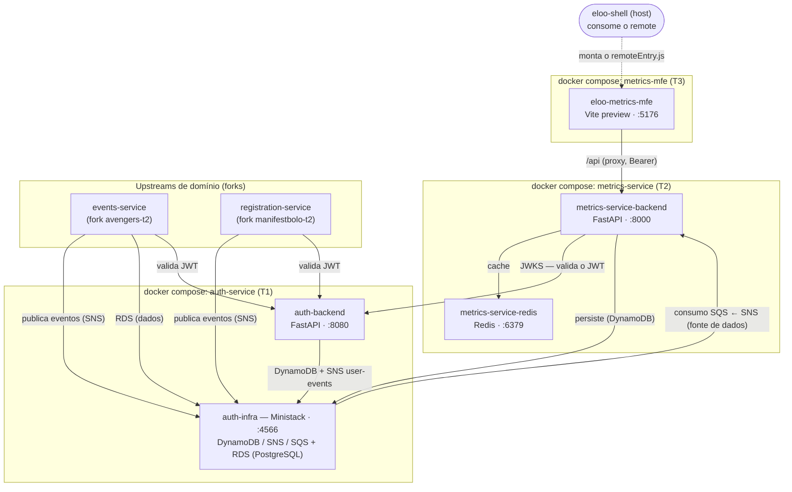
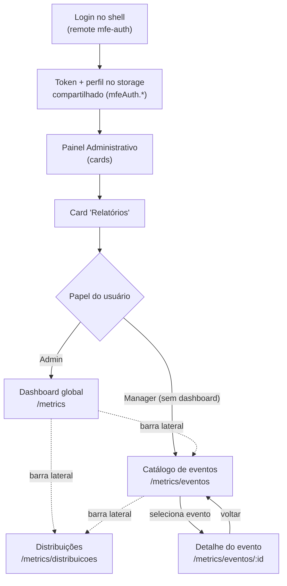

# Eloo Metrics MFE (T3) — Microfrontend de Métricas de Eventos

Microfrontend web (**remote** de [Module Federation](https://github.com/originjs/vite-plugin-federation)) que consome a **API do Metrics Service (T2)** e apresenta as métricas de eventos — counters, engajamento, distribuições demográficas e séries históricas — em um painel visual. É montado pelo host [`eloo-shell`](eloo-shell) e reutiliza a autenticação do **Auth Service (T1)**. Construído com **React 18**, **TypeScript**, **Vite**, **MUI 6 + MUI X Charts** e **TailwindCSS**.

> Trabalho da disciplina de **Construção de Software** — PUCRS, 2026/1 · Grupo **0x**.

### Autores — Grupo 0x

- Carlos Eduardo B. Mascarello
- Lucas A. Brentano
- Victória C. Marques

---

## Índice

1. [Visão Geral](#visão-geral)
2. [Funcionalidades](#funcionalidades)
3. [Tech Stack](#tech-stack)
4. [Arquitetura](#arquitetura)
5. [Começando](#começando)
6. [Variáveis de Ambiente](#variáveis-de-ambiente)
7. [Scripts](#scripts)
8. [Fluxos de Uso](#fluxos-de-uso)
9. [Testes](#testes)
10. [Controle de Versões e CI/CD](#controle-de-versões-e-cicd)
11. [FAQ e Troubleshooting](#faq-e-troubleshooting)
12. [Documentação](#documentação)

---

## Visão Geral

### O quê

O Metrics MFE é a **ponta de visualização** (read-only) da plataforma Eloo. Ele **não é fonte de verdade** dos dados: lê tudo do **Metrics Service (T2)** por uma camada de serviço (`metricsApi.ts`) e renderiza dashboards. Como **remote de Module Federation**, é montado dentro do `eloo-shell` (host), que é dono do layout, tema e roteamento; também roda **standalone** em dev. Segue o **contrato de página remote** ([ADR-0005](eloo-metrics-mfe/adr/0005-contrato-paginas-remote.md)): cada tela recebe `theme?`, reporta ações por callbacks e não gerencia sessão nem navega sozinha.

### Para quem

- **Admin** (papel no perfil do Auth) — **visão global**: dashboard de todos os eventos.
- **Manager** — **escopo próprio**: sem dashboard global (a rota o redireciona ao catálogo); vê só os eventos sob sua gestão; demografia por evento.
- O RBAC **real** é do backend (T2 escopa por papel — [ADR-0009](eloo-metrics-mfe/adr/0009-contrato-api-metrics.md)); o frontend só adapta título/navegação.

### Quais limites

- **Não emite tokens nem faz login** — reutiliza o Auth (T1) via o remote `mfe-auth`; o metrics só lê o token/perfil do storage compartilhado (`mfeAuth.*`).
- **Não escreve dados** — a API do T2 é de leitura; o estado é alimentado pela ingestão assíncrona (forks → SNS/SQS → T2, [ADR-0008](eloo-metrics-mfe/adr/0008-refatoracao-upstreams-sns-sqs.md)).
- **Deploy é MVP** — a imagem serve o remote via `vite preview` (não é servidor de produção — [ADR-0012](eloo-metrics-mfe/adr/0012-deploy-docker-compose.md)).

---

## Funcionalidades

Cada feature cita a User Story (US) que a implementou. O backlog vive em [`eloo-metrics-mfe/docs/backlog/`](eloo-metrics-mfe/docs/backlog/) e nas [Issues do GitHub](https://github.com/pucrs-csw-2026-1/0x_t3/issues).

| Funcionalidade                                                             | US    | Detalhe                                                                           |
| -------------------------------------------------------------------------- | ----- | --------------------------------------------------------------------------------- |
| Scaffold Vite + React + TS + Module Federation (remote `mfeMetrics`)       | US-00 | Estrutura de pastas, tema MUI, contrato de remote                                 |
| Camada de serviço: `authApi` (reuso T1) + `metricsApi` (único acesso a T2) | US-01 | Todo `fetch` passa por `services/`; proxy `/api`·`/auth-api` (ADR-0003)           |
| Dashboard — visão geral (counters, engajamento, ranking de adesão)         | US-02 | Adaptável por papel (admin global / manager escopo)                               |
| Distribuições demográficas (idade, gênero, cidade, perfil, tipo, horas)    | US-03 | 6 painéis independentes (loading/erro/vazio próprios)                             |
| Catálogo de eventos (paginação server-side, busca local, período)          | US-04 | Porta de entrada para o detalhe                                                   |
| Detalhe do evento + séries históricas (por tipo)                           | US-05 | Taxa de check-in/certificação + gráfico de linha                                  |
| Validação da integração real (T1 + T2) + suíte `test:e2e:real`             | US-06 | Camada alinhada ao contrato real do T2 (ADR-0009); RBAC, 403/404, sessão, vazio   |
| Integração no shell (remote montado, acesso pelo card "Relatórios")        | US-07 | `RemoteSlot` + tema + callbacks; barra lateral do host; RBAC por papel (ADR-0010) |
| Refatoração dos forks → SNS/SQS (alimenta o T2)                            | US-08 | Nos repositórios dos forks (ADR-0008)                                             |
| Documentação: README, diagrama de arquitetura, fluxos, FAQ, board          | US-09 | Este documento                                                                    |
| Empacotamento Docker + `docker-compose` + pipeline de deploy (CD)          | US-10 | `docker compose up` serve o remote sem npm (ADR-0012)                             |

Robustez transversal: tratamento explícito de **loading / erro / vazio / sessão expirada (401) / sem permissão (403) / não encontrado (404) / filtro inválido (422)** em toda tela, com mensagens em pt-BR e cobertura de testes dos caminhos de erro.

---

## Tech Stack

| Camada                  | Tecnologia                                                                                                                                                                            |
| ----------------------- | ------------------------------------------------------------------------------------------------------------------------------------------------------------------------------------- |
| Biblioteca de UI        | [React 18](https://react.dev/)                                                                                                                                                        |
| Linguagem               | [TypeScript 5](https://www.typescriptlang.org/)                                                                                                                                       |
| Build tool / dev server | [Vite 5](https://vite.dev/)                                                                                                                                                           |
| Microfrontend           | [Module Federation](https://github.com/originjs/vite-plugin-federation) (`@originjs/vite-plugin-federation`, modo remote)                                                             |
| Componentes / tema      | [MUI 6](https://mui.com/material-ui/) (Material Design) + [Emotion](https://emotion.sh/)                                                                                              |
| Gráficos                | [MUI X Charts](https://mui.com/x/react-charts/) (não compartilhado na federação — [ADR-0010](eloo-metrics-mfe/adr/0010-contrato-remote-shell.md))                                     |
| Layout utilitário       | [TailwindCSS 3](https://tailwindcss.com/) (tokens espelham o `DESIGN.md`)                                                                                                             |
| Roteamento              | [react-router-dom 6](https://reactrouter.com/)                                                                                                                                        |
| Testes                  | [Vitest](https://vitest.dev/) + [Testing Library](https://testing-library.com/) (unit/integração), [MSW](https://mswjs.io/) (integração), [Playwright](https://playwright.dev/) (E2E) |
| Lint / Format           | [ESLint](https://eslint.org/) + [Prettier](https://prettier.io/)                                                                                                                      |
| Empacotamento / deploy  | [Docker](https://www.docker.com/) + `docker-compose` + [GitHub Actions](https://github.com/features/actions) (CI/CD)                                                                  |

Stack fixada pelos ADRs ([ADR-0001](eloo-metrics-mfe/adr/0001-arquitetura-microfrontend.md) / [ADR-0002](eloo-metrics-mfe/adr/0002-stack-tecnica.md)); mudanças exigem novo ADR aprovado.

---

## Arquitetura

Cada serviço roda no **seu próprio container** (agrupados por `docker compose`), ligados entre si: o MFE (T3) fala com a API de métricas (T2); a API de métricas fala com o **Ministack** (DynamoDB/SNS/SQS) e com a API de auth (T1). Os containers cruzam as redes dos composes distintos via `host.docker.internal`.



> A Ministack (`auth-infra`, do compose do Auth) é **compartilhada** por T1/T2 (o Metrics a reaproveita via `host.docker.internal:4566`) e também provê o **RDS (PostgreSQL)** usado pelo `events-service`. A **fonte de dados do Metrics é o SQS**: os **forks** (`events-service` = avengers-t2; `registration-service` = manifestbolo-t2) publicam eventos de domínio no SNS, que faz fan-out para as filas SQS consumidas pelo Metrics ([ADR-0008](eloo-metrics-mfe/adr/0008-refatoracao-upstreams-sns-sqs.md)) — o Metrics **não** chama as APIs dos forks. Ambos os forks validam o JWT no Auth para suas próprias APIs.

**Princípios** (verificados pelos subagents `architecture-guard`/`vv-check`):

- **Integração** ([ADR-0003](eloo-metrics-mfe/adr/0003-integracao-apis-t1-t2.md)): requisições vão para `/api` (Metrics) e `/auth-api` (Auth) na própria origem e são _proxied_ server-to-server pelo `vite.config.ts` (contorno de CORS). **Todo** acesso a rede passa por `services/` — componentes nunca fazem `fetch`.
- **Contrato de remote** ([ADR-0005](eloo-metrics-mfe/adr/0005-contrato-paginas-remote.md) / [ADR-0010](eloo-metrics-mfe/adr/0010-contrato-remote-shell.md)): cada página recebe `theme?` e reporta ações por callbacks; navegação e proteção de rota são do **host**.
- **Gráficos** ([ADR-0004](eloo-metrics-mfe/adr/0004-biblioteca-graficos.md)): MUI X Charts, sempre recebendo dados por props (nunca fazem fetch).

Estrutura de pastas (o código do T3 vive em `eloo-metrics-mfe/`):

```
eloo-metrics-mfe/
  src/
    pages/              uma tela por arquivo, exposta como remote (Dashboard, EventCatalog, Demographics, EventMetrics)
    components/         UI compartilhada
    components/charts/  gráficos MUI X reutilizáveis (recebem dados por props)
    hooks/              useDistribution (estado de um painel de distribuição)
    services/           authApi.ts (reuso T1) + metricsApi.ts (único acesso a T2)
    utils/              format, periods, ranking, scope, demographics (lógica pura)
    test/               setup do Vitest + handlers MSW (integração)
    theme.ts · App.tsx  tema/router standalone (só quando roda sozinho)
  e2e/                  testes Playwright (mock e *.real.spec.ts)
  adr/                  Architecture Decision Records (0001–0012) + índice
  Dockerfile · .dockerignore
docker-compose.yml      sobe o remote (:5176) — ver ADR-0012
.github/workflows/      ci.yml · cd.yml · sync-dev.yml
```

---

## Começando

Os comandos `npm` rodam em `eloo-metrics-mfe/`; o `docker compose` roda na **raiz** do repo.

### Standalone (dev, com mock)

```bash
cd eloo-metrics-mfe
npm install
cp .env.example .env      # aponta para Metrics (T2) e Auth (T1)
npm run dev               # standalone em http://localhost:5177
```

### Como remote para o shell

O dev server sozinho **não gera** `remoteEntry.js` — para o shell consumir, sirva o build:

```bash
cd eloo-metrics-mfe
npm run serve:remote      # vite build && vite preview --port 5176
```

### Via Docker (sem npm)

Sobe **só** o remote de métricas na `:5176` via `docker compose` ([ADR-0012](eloo-metrics-mfe/adr/0012-deploy-docker-compose.md)) — os backends T1/T2 rodam à parte:

```bash
docker compose up         # na raiz do repo · remote em http://localhost:5176
```

O container alcança T1 (`:8080`) e T2 (`:8000`) do **host** via `host.docker.internal`.

---

## Variáveis de Ambiente

Lidas pelo `vite.config.ts` (proxy server-to-server) e pela camada de serviço. Ver `eloo-metrics-mfe/.env.example`.

| Variável              | Onde                      | Padrão                  | Para quê                                                              |
| --------------------- | ------------------------- | ----------------------- | --------------------------------------------------------------------- |
| `METRICS_SERVICE_URL` | `.env` / env do container | `http://localhost:8000` | Alvo do proxy `/api` → Metrics (T2)                                   |
| `AUTH_SERVICE_URL`    | `.env` / env do container | `http://localhost:8080` | Alvo do proxy `/auth-api` → Auth (T1)                                 |
| `VITE_USE_MOCKS`      | `.env.development` apenas | (desligado)             | Modo demonstração (dados mockados, sem rede). Nunca em produção/teste |

No Docker os alvos de proxy apontam por padrão para `http://host.docker.internal:8000` / `:8080`.

---

## Scripts

| Script                          | O que faz                                  |
| ------------------------------- | ------------------------------------------ |
| `npm run dev`                   | dev server standalone (:5177)              |
| `npm run build`                 | `tsc -b` + build de produção               |
| `npm run serve:remote`          | build + preview como remote (:5176)        |
| `npm run lint` / `format:check` | ESLint / Prettier                          |
| `npm run test` / `test:cov`     | Vitest (unit + integração) / com cobertura |
| `npm run test:e2e`              | Playwright (E2E, mock)                     |
| `npm run test:e2e:real`         | Playwright contra T1/T2 reais (local)      |

---

## Fluxos de Uso

O RBAC é do backend (T2 escopa por papel — [ADR-0009](eloo-metrics-mfe/adr/0009-contrato-api-metrics.md)); o frontend só adapta título/navegação. Decisões de produto da US-06:

### Como remote no shell (fluxo principal)

1. **Login** no shell (`:5173`) via `mfe-auth` → o token/perfil ficam no storage compartilhado (`mfeAuth.accessToken`/`mfeAuth.profile`), mesma origem.
2. **Painel Administrativo** → card **"Relatórios"** libera o dashboard de métricas.
3. A seção `/metrics` tem **barra lateral do shell** (Dashboard · Catálogo · Distribuições).



| Papel       | Dashboard global | Entrada em `/metrics`       | Escopo dos dados             |
| ----------- | ---------------- | --------------------------- | ---------------------------- |
| **Admin**   | sim              | Dashboard global            | todos os eventos             |
| **Manager** | **não**          | redireciona ao **Catálogo** | só os eventos sob sua gestão |

- **Manager não tem dashboard global**: a rota `/metrics` o redireciona ao catálogo, e o item "Dashboard" some do menu. A demografia dele é **por evento** (auto-seleciona o 1º do escopo).
- **Série histórica é por TIPO de evento** (o T2 não tem série por evento — o subtítulo do gráfico explicita o escopo agregado).

### Standalone (dev)

Rodando sozinho (`:5177`), o próprio `App.tsx` faz o papel de host (sidebar + navegação). Para autenticar em dev sem o shell, use o helper `public/dev-login.html` (dev-only, credenciais hardcoded, **fora do git**) ou o modo mock (`VITE_USE_MOCKS=true`).

---

## Testes

Pirâmide de testes ([ADR-0011](eloo-metrics-mfe/adr/0011-estrategia-de-testes.md)), rodados a partir de `eloo-metrics-mfe/`:

```bash
npm run test           # Vitest — unit (RTL) + integração (MSW contra o contrato do T2)
npm run test:cov       # com cobertura (gate ≥ 80%)
npm run test:e2e       # Playwright (E2E, mock — roda no CI)
npm run test:e2e:real  # Playwright contra T1/T2 reais (local)
```

Técnicas de caixa-preta na lógica de formatação/estado (partição de equivalência, valor-limite, transição de estado) e **testes dos caminhos de erro** (401/403/404/422/5xx, rede, JSON inválido, vazio, race). A meta de **≥ 80% de cobertura** é gate no CI.

### E2E real (`test:e2e:real`)

Valida **todas as telas contra o backend real** (US-06): dashboard, catálogo, distribuições e detalhe, com RBAC (admin/manager), 403/404, sessão expirada e estado vazio. Sobe o dev server em `:5178` com `VITE_USE_MOCKS=false`. Pré-requisitos (uma vez por ambiente):

```bash
# 1. T1 (Auth) no ar + pool de participantes
cd 0x_t1 && docker compose up -d
docker compose --profile seed run --rm seed-users

# 2. T2 (Metrics) no ar + seed de eventos (50 eventos; escopo do manager = evt_0000..evt_0009)
cd ../0x_t2 && docker compose up -d
docker compose run --rm --no-deps -e METRICS_SEED_FORCE=1 seed

# 3. Rodar a suíte real
cd ../eloo-metrics-mfe && npm run test:e2e:real
```

Credenciais do seed: `admin@local.dev`/`Admin@123` (visão global) e `manager@local.dev`/`Manager@123` (escopo de 10 eventos).

---

## Controle de Versões e CI/CD

**GitFlow**: `main` ← `dev` ← `feature/us-NN-<slug>`; commits em **Conventional Commits** (`feat`, `fix`, `docs`, `style`, `refactor`, `test`, `chore`), sem `Co-Authored-By`. Nunca se commita direto em `main`/`dev`. Detalhes em [CONTRIBUTING.md](CONTRIBUTING.md) e [CLAUDE.md](eloo-metrics-mfe/CLAUDE.md).

### CI (`ci.yml`) — todo push/PR para `dev` e `main`

| Job           | O que faz                                     |
| ------------- | --------------------------------------------- |
| **lint**      | `eslint` + `prettier --check`                 |
| **typecheck** | `tsc -b`                                      |
| **test**      | Vitest com cobertura (`test:cov`, gate ≥ 80%) |
| **e2e**       | Playwright (E2E mock, `chromium`)             |
| **build**     | `npm run build` (produção)                    |

### CD (`cd.yml`) — push para `main` ([ADR-0012](eloo-metrics-mfe/adr/0012-deploy-docker-compose.md))

Roda os gates (lint → typecheck → test), builda a imagem via **`docker compose build`** e publica um **release beta idempotente** (sem push para registry — alinhado ao T2). Garante que quem recebe um release só precise de `docker compose up`.

### Governança

- **`sync-dev.yml`** — após cada push em `main`, faz merge de `main` em `dev`, garantindo que `dev` nunca fique atrás de `main`.

---

## FAQ e Troubleshooting

### FAQ — perguntas conceituais

#### Como autentico para ver as métricas?

O metrics **não faz login** — reutiliza o Auth (T1). No shell você loga pelo remote `mfe-auth`, e o token/perfil ficam no storage compartilhado (`mfeAuth.*`), lidos automaticamente pelo metrics. Standalone (dev), use o helper `public/dev-login.html` ou o modo mock (`VITE_USE_MOCKS=true`).

#### O metrics-mfe chama a API do Auth?

Não. Ele só **lê** o token/perfil do `localStorage` (gravado pelo `mfe-auth`) e envia o Bearer **apenas para o metrics API (T2)**. Quem valida o token contra o Auth (JWKS) é o próprio metrics API. O proxy `/auth-api` existe só para o `dev-login.html` (dev-only, fora da imagem).

#### Por que o manager vê menos que o admin?

RBAC do T2 ([ADR-0009](eloo-metrics-mfe/adr/0009-contrato-api-metrics.md)): o admin tem visão global; o manager vê só os eventos do seu escopo e **não** tem dashboard global (entra pelo catálogo). O frontend só adapta a UI — o filtro real é do backend.

#### O que é o modo mock (`VITE_USE_MOCKS`)?

Um _dev-aid_: a camada de serviço devolve dados mockados sem tocar a rede, para rodar o dashboard standalone sem o T2 no ar. Só liga via `.env.development`; nunca em teste ou produção.

#### De onde vêm os dados exibidos?

Do T2, cuja **fonte é o SQS**: os forks (events/registration) publicam no SNS → fan-out para as filas SQS → o T2 consome e persiste. O metrics lê a API do T2 via `/api` ([ADR-0008](eloo-metrics-mfe/adr/0008-refatoracao-upstreams-sns-sqs.md)).

### Troubleshooting — problemas comuns

#### `NetworkError` / requisição a `/api/metrics/...` bloqueada

**Ad blocker** (uBlock e afins) bloqueiam URLs com "metrics". Desative para `localhost`.

#### O remote não carrega no shell ("Não foi possível carregar este módulo")

O `serve:remote` (`:5176`) não está no ar, ou você subiu o `dev` (`:5177`), que **não gera** `remoteEntry.js`. Confira `http://localhost:5176/assets/remoteEntry.js`.

#### Login no auth standalone não autentica o metrics standalone

`localStorage` é por origem: logar no auth (`:5175`) não vale para o metrics (`:5177`). Só o **shell** (mesma origem) unifica a sessão; em dev, use o `dev-login.html`.

#### A sessão cai / redireciona para o login

Um `401` numa chamada autenticada limpa os tokens e dispara o evento `mfeAuth:sessionExpired`; o **host** (shell) escuta e redireciona. A página do remote nunca redireciona sozinha (ADR-0005).

#### Erro de CORS nas chamadas

Nem o T2 nem o T1 enviam headers CORS; o `vite.config.ts` faz o proxy server-to-server (`/api`). No Docker, o container alcança os backends do host via `host.docker.internal`.

#### Counters aparecem zerados

O T1 precisa ter o pool de participantes seedado **antes** (ou junto) do seed do T2; re-seede o T2 com `METRICS_SEED_FORCE=1`. O cache Redis do T2 tem TTL de 30s (`redis-cli flushall` para ver os dados novos na hora).

#### Ministack não responde em `:4566`

A Ministack é externa e **compartilhada** por T1/T2. Suba o Auth (T1) primeiro (`cd 0x_t1 && docker compose up -d`); o T2 e o container do MFE a alcançam via `host.docker.internal:4566`.

#### Terraform do T2 falha ("timeout while waiting for plugin to start")

Cache de provider: remova `0x_t2/infra/terraform/.terraform*` e re-rode (use `--no-deps` para não redisparar o terraform).

#### Processo Vite "órfão" no Windows

Matar o `npm run dev`/`serve:remote` nem sempre mata a árvore; o vite segue escutando a porta. Confira com `netstat -ano | findstr :5176` e mate o PID antes de re-subir.

#### Os gráficos "somem"

O projeto usa `skipAnimation` em todos os charts (a animação de entrada os deixava invisíveis com "efeitos de movimento" reduzidos no SO). Não remover.

---

## Documentação

- [Índice de ADRs](eloo-metrics-mfe/adr/README.md) (0001–0012) · [CLAUDE.md](eloo-metrics-mfe/CLAUDE.md) · [CONTRIBUTING.md](CONTRIBUTING.md)
- Backlog de User Stories: [`eloo-metrics-mfe/docs/backlog/`](eloo-metrics-mfe/docs/backlog/)
- Repositórios irmãos: [Auth Service (T1)](https://github.com/pucrs-csw-2026-1/0x_t1) · [Metrics Service (T2)](https://github.com/pucrs-csw-2026-1/0x_t2)
